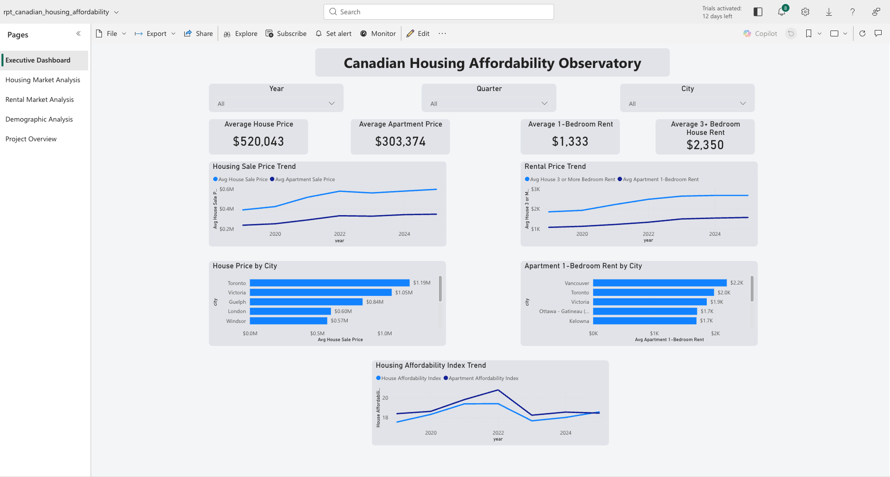
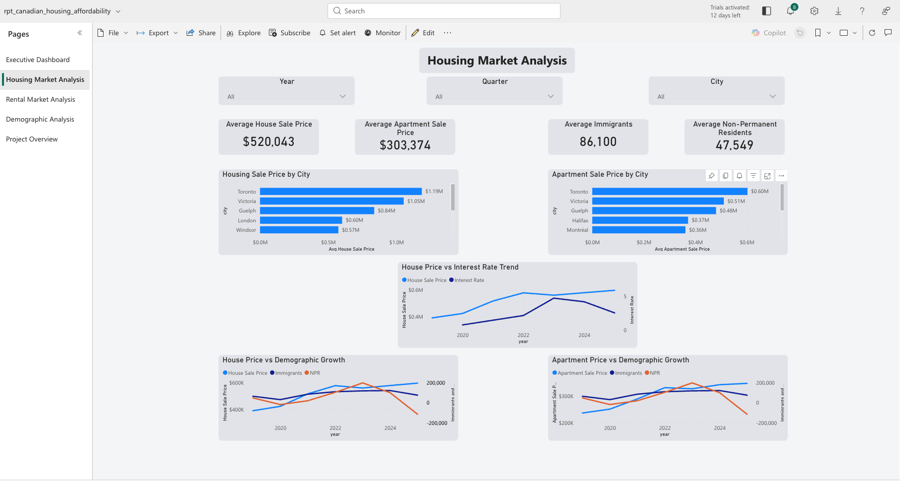
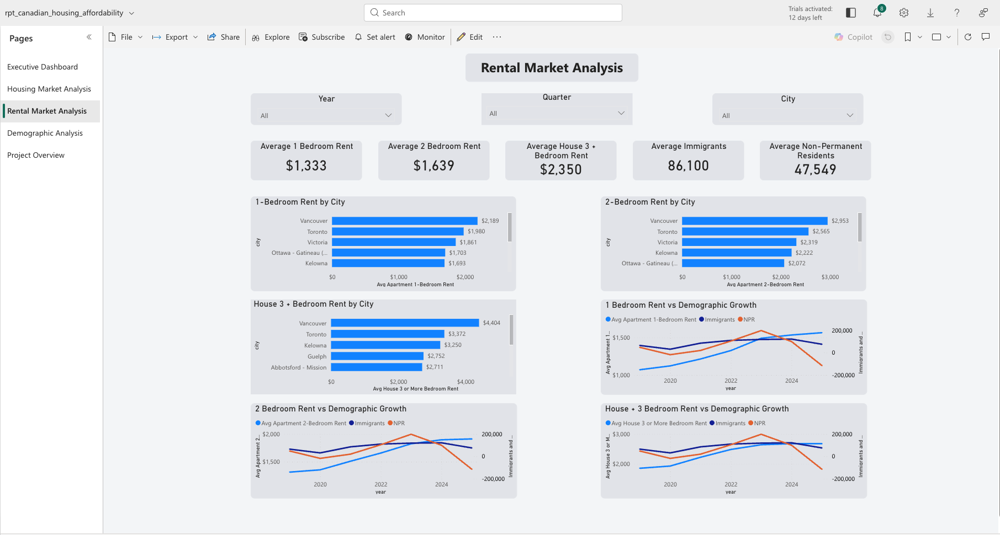
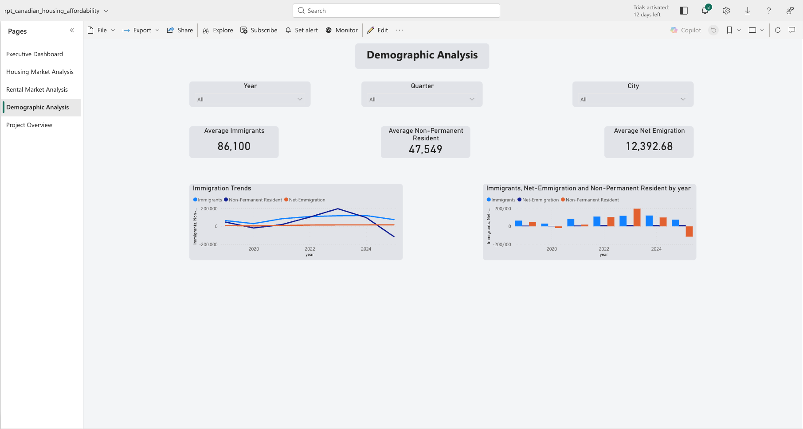
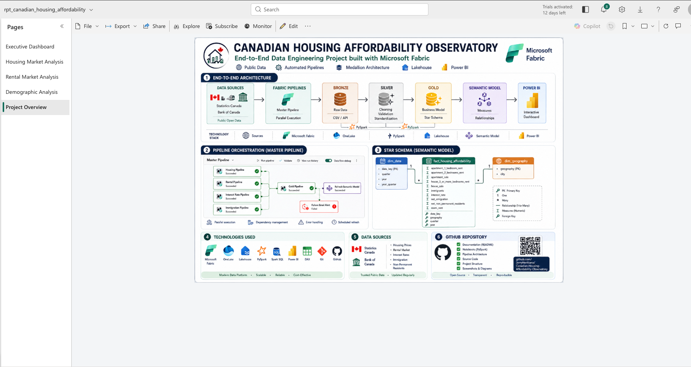

# 🏠 Canadian Housing Affordability Observatory

> **An end-to-end Microsoft Fabric Data Engineering project analyzing housing affordability trends across Canada.**

<p align="center">

Microsoft Fabric • OneLake • Lakehouse • PySpark • Data Pipelines • Power BI • GitHub

</p>

---

# 📖 Project Overview

The **Canadian Housing Affordability Observatory** is an end-to-end Microsoft Fabric project designed to collect, transform, model and visualize Canadian housing affordability indicators.

The project combines multiple Canadian public datasets to analyze housing prices, rental markets, immigration and interest rates through a modern Data Engineering architecture based on the **Medallion Architecture (Bronze → Silver → Gold)**.

The final analytical model is exposed through an interactive **Power BI** report.

---

# 🎯 Project Objectives

- Build a complete Microsoft Fabric Data Engineering solution
- Implement a Medallion Architecture (Bronze, Silver, Gold)
- Automate ELT workflows using Microsoft Fabric Pipelines
- Transform data using PySpark notebooks
- Design a Star Schema optimized for analytics
- Develop interactive Power BI dashboards
- Publish a production-style portfolio project

---

# 🏗️ Solution Architecture

<p align="center">

</p>

The solution follows a modern Microsoft Fabric architecture:

```
Public Data Sources
        │
        ▼
Fabric Pipelines
        │
        ▼
OneLake Bronze
        │
        ▼
PySpark Transformations
        │
        ▼
OneLake Silver
        │
        ▼
Business Modeling
        │
        ▼
Gold Layer
        │
        ▼
Semantic Model
        │
        ▼
Power BI
```

---

# ⭐ Key Features

- ✅ End-to-End Data Engineering Project
- ✅ Microsoft Fabric
- ✅ OneLake Storage
- ✅ Lakehouse Architecture
- ✅ Medallion Architecture
- ✅ PySpark Data Transformation
- ✅ Automated ELT Pipelines
- ✅ Star Schema
- ✅ Semantic Model
- ✅ Interactive Power BI Dashboards

---

# 🗂 Repository Structure

```
canadian-housing-affordability-observatory

├── architecture/
├── docs/
├── notebooks/
├── pipelines/
├── powerbi/
├── screenshots/
├── sql/
├── README.md
└── LICENSE
```

---

# 🛠 Technology Stack

| Layer | Technology |
|--------|------------|
| Data Platform | Microsoft Fabric |
| Storage | OneLake |
| Data Warehouse | Lakehouse |
| Processing | PySpark |
| Orchestration | Fabric Data Pipelines |
| Modeling | Semantic Model |
| Visualization | Power BI |
| Version Control | Git & GitHub |

---

# 📊 Data Sources

| Source | Dataset |
|---------|----------|
| Statistics Canada | Housing Sale Prices |
| Statistics Canada | Rental Prices |
| Statistics Canada | Immigration |
| Bank of Canada | Interest Rates |

---

# 🔄 Pipeline Orchestration

The ELT workflow is orchestrated using **Microsoft Fabric Data Pipelines**.

## Workflow

- Housing Prices Pipeline
- Rental Prices Pipeline
- Interest Rates Pipeline
- Immigration Pipeline

↓

Gold Model Generation

↓

Semantic Model Refresh

↓

Power BI Dashboards

### Features

- Parallel execution
- Dependency management
- Error handling
- Automated Semantic Model Refresh
- Monthly scheduled execution

<p align="center">


</p>

---

# ⭐ Medallion Architecture

## 🥉 Bronze

Raw data ingestion from public sources.

## ⚪ Silver

Cleaning, validation and standardization using PySpark.

## 🟡 Gold

Business-ready analytical datasets optimized for reporting.

---

# 📐 Semantic Model

The analytical model follows a **Star Schema**.

### Fact Table

- fact_housing_affordability

### Dimensions

- dim_date
- dim_geography

<p align="center">


</p>

---

# 📈 Power BI Report

## Executive Dashboard



---

## Housing Market Analysis



---

## Rental Market Analysis



---

## Demographic Analysis



---

## Project Overview



---

# 📄 Power BI Report (PDF)

A static version of the report is available in:

```
powerbi/canadian_housing_affordability_observatory.pdf
```

---

# 🚀 Getting Started

Clone the repository

```bash
git clone https://github.com/JerryHeritian/canadian-housing-affordability-observatory.git
```

Open the Microsoft Fabric workspace.

Run the ingestion pipelines.

Execute the PySpark notebooks.

Refresh the Semantic Model.

Open the Power BI report.

---

# 🔮 Future Improvements

- Near real-time data ingestion
- Additional economic indicators
- Predictive analytics using Machine Learning
- Fabric Data Activator integration
- CI/CD deployment

---

# 👨‍💻 Author

**Jerry Heritiana**

Data Engineer | Microsoft Fabric | PySpark | Power BI

📍 Québec, Canada

**LinkedIn**

https://www.linkedin.com/in/jerry-heritiana-9b6139178/
