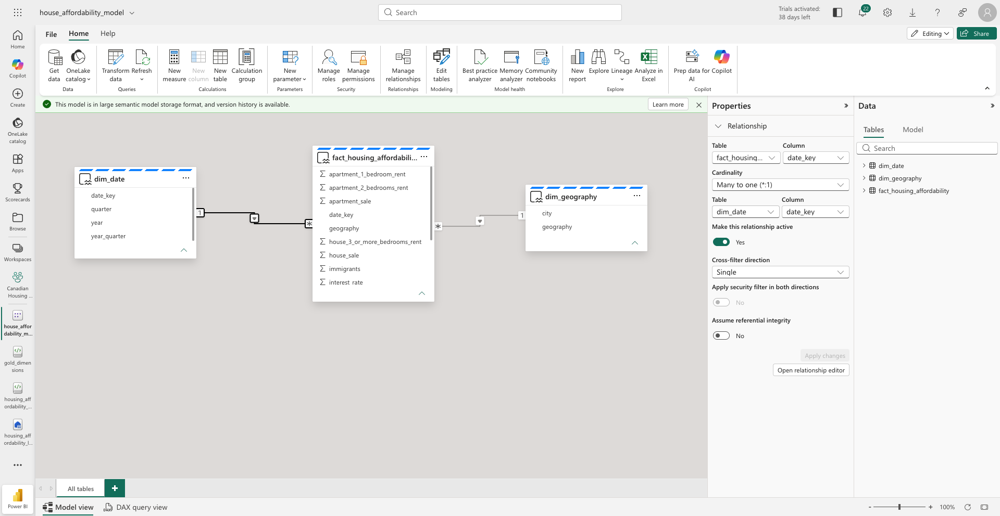

# 🇨🇦 Canadian Housing Affordability Observatory

# canadian-housing-affordability-observatory
End-to-end Microsoft Fabric project analyzing housing affordability trends across Canada.

## Overview

Canadian Housing Affordability Observatory is an end-to-end Microsoft Fabric project designed to analyze housing affordability trends across Canada.

The project combines housing, immigration, demographic and economic data from multiple Canadian public sources to understand how population growth, immigration, housing supply and interest rates impact housing affordability.

---

## Business Problem

Housing affordability has become one of the most important challenges in Canada.

This project aims to answer questions such as:

* How have housing prices evolved across Canadian provinces?
* What is the relationship between immigration and housing demand?
* How does population growth affect housing affordability?
* What is the impact of interest rates on the housing market?
* Are housing construction rates keeping pace with population growth?

---

## Project Objectives

* Build an end-to-end data platform using Microsoft Fabric
* Ingest data from multiple public Canadian sources
* Implement a Medallion Architecture (Bronze, Silver, Gold)
* Transform and enrich data using Spark
* Create business-ready datasets
* Develop interactive Power BI dashboards
* Publish and document a complete portfolio project

---

## Data Sources

### Statistics Canada (StatCan)

* Population
* Immigration
* Demographic indicators
* Inflation

### Canada Mortgage and Housing Corporation (CMHC)

* Housing starts
* Vacancy rates
* Rental market indicators

### Bank of Canada

* Interest rates
* Economic indicators

---

## Technology Stack

* Microsoft Fabric
* Data Factory
* OneLake
* Lakehouse
* Apache Spark
* Power BI
* GitHub

---

## Architecture

```text
Sources
(SQL / API / CSV)

↓

Data Factory

↓

OneLake

↓

Lakehouse

├── Bronze
├── Silver
└── Gold

↓

Power BI

↓

Dashboards
```

---

## Medallion Architecture

### Bronze Layer

Raw data from source systems.

### Silver Layer

Cleaned, standardized and validated data.

### Gold Layer

Business-ready datasets optimized for reporting and analytics.

---

## Planned Dashboards

### Executive Dashboard

* Housing affordability overview
* Key indicators
* National trends

### Housing Dashboard

* Housing prices
* Rental market
* Vacancy rates

### Immigration Dashboard

* Immigration trends
* Provincial distribution

### Population Dashboard

* Population growth
* Demographic trends

### Correlation Dashboard

* Immigration vs Housing
* Population vs Housing Supply
* Interest Rates vs Housing Market

## Semantic Model

The project follows a Star Schema composed of:

- Fact table: `fact_housing_affordability`
- Dimensions:
  - `dim_date`
  - `dim_geography`




## ELT Orchestration Pipeline

The project implements a multi-stage ELT orchestration using Microsoft Fabric Data Pipelines.

### Pipeline architecture

- Four domain-specific pipelines run in parallel:
  - Housing Prices
  - Rental Prices
  - Interest Rates
  - Immigration

- Once all pipelines complete successfully, the Gold Model pipeline generates:
  - Dimension tables
  - Housing Affordability fact table

- Finally, the Semantic Model is refreshed automatically so Power BI dashboards always display the latest data.

### Features

- Medallion Architecture (Bronze → Silver → Gold)
- Parallel pipeline execution
- Dependency management
- Dataset-specific error handling
- Automated semantic model refresh
- Monthly scheduled execution


## Author

Jerry Heritiana

Data Engineering & Analytics Portfolio Project

Canada - Québec
